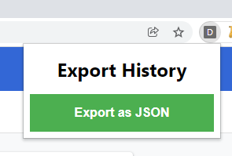

# Google Chrome History Exporter

This plugin allows you to export your _(almost)_ entire browsing history as a JSON file.

## Installation

- Download this repository
- Go to `chrome://extensions/` on Google Chrome and enable **Developer Mode**
- Click on _Load unpacked_ and select the repository folder
- Done!